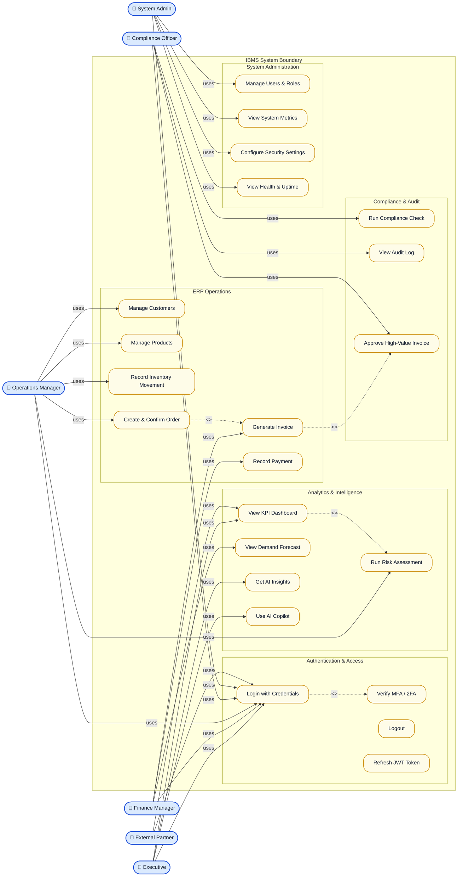
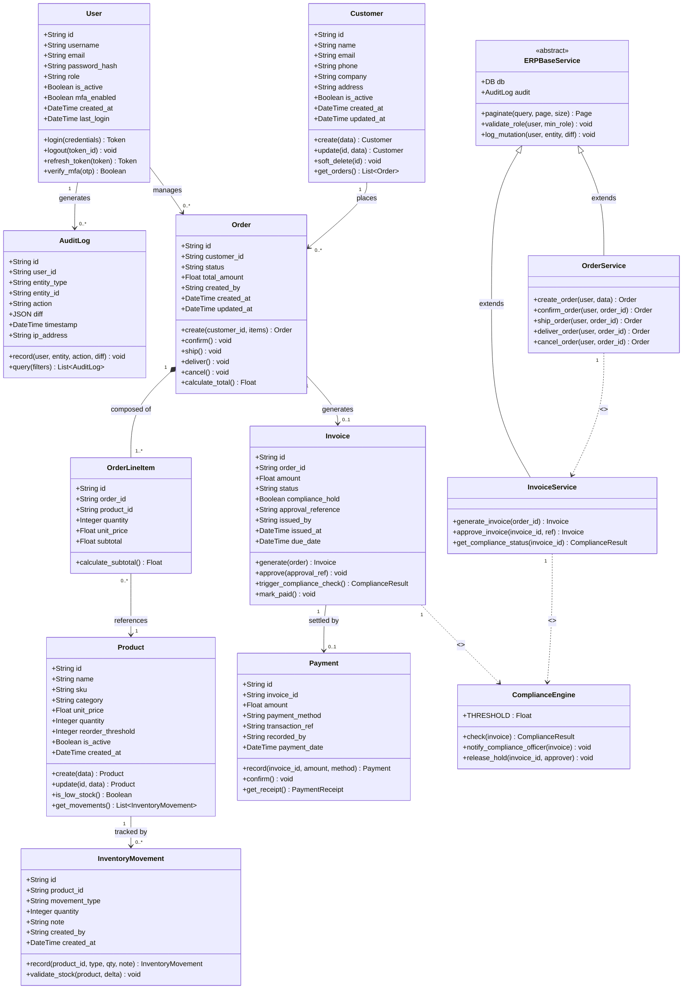

# UML Diagrams — IBMS (Integrated Business Management Suite)

| Field              | Detail                                              |
|--------------------|-----------------------------------------------------|
| **Project Name**   | Integrated Business Management Suite (IBMS) v2.0    |
| **Team**           | Shivansh Srivastava (Product Developer), Prahallad Padhan (Product Owner), Ranveer Rai Khare (Scrum Master) |
| **Sprint**         | Sprint 2                                            |
| **Date**           | April 24, 2026                                      |
| **Course**         | SEPM (Software Engineering and Project Management)  |
| **Standard**       | UML 2.5 (Unified Modeling Language)                 |

---

## Diagram Index

| # | Diagram Type      | Title                              | Purpose                                          |
|---|-------------------|------------------------------------|--------------------------------------------------|
| 1 | Use Case Diagram  | IBMS System — Actor Use Cases      | Defines actors and their interactions with IBMS  |
| 2 | Class Diagram     | IBMS ERP — Domain Model             | Shows ERP entity structure and associations      |
| 3 | Sequence Diagram  | Order-to-Cash Business Flow        | Traces full lifecycle from order to payment      |

---

## Diagram 1: Use Case Diagram

**Purpose:** Shows all primary actors in the IBMS system and the use cases each actor can perform. Relationships include `<<include>>` (mandatory sub-flow) and `<<extend>>` (optional sub-flow).



### 1.1 Actor Descriptions

| Actor               | Role Description                                                                         |
|---------------------|------------------------------------------------------------------------------------------|
| **Executive**       | Views KPI dashboards, AI insights, and strategic forecasts; read-only on most ERP data   |
| **Finance Manager** | Generates invoices, records payments, views financial forecasts; write access to ERP finance flows |
| **Operations Manager** | Full CRUD on customers, products, inventory; creates and confirms orders              |
| **Compliance Officer** | Runs compliance checks, reviews audit logs, approves high-value invoices (> ₹500k)  |
| **System Admin**    | Manages all users and roles; views system metrics and health; configures security settings |
| **External Partner** | Limited access via dedicated partner token; views KPI dashboard and submits requests   |

### 1.2 Use Case Relationships

| Relationship          | From                    | To                       | Type         | Notes                                     |
|-----------------------|-------------------------|--------------------------|--------------|-------------------------------------------|
| Login → 2FA           | Login with Credentials  | Verify MFA / 2FA         | `<<include>>`| 2FA is mandatory for all users            |
| Create Order → Invoice | Create & Confirm Order | Generate Invoice         | `<<include>>`| Invoice auto-generated on order confirm   |
| Generate Invoice → Approve | Generate Invoice  | Approve High-Value Invoice | `<<extend>>`| Triggered only when amount > ₹500,000   |
| View KPI → Risk       | View KPI Dashboard      | Run Risk Assessment      | `<<include>>`| KPI dashboard embeds risk scores          |

---

## Diagram 2: Class Diagram

**Purpose:** Defines the complete IBMS ERP domain model — all entity classes, their attributes, methods, and inter-class relationships (associations, compositions, dependencies).



### 2.1 Class Relationship Summary

| Relationship                   | Type          | Multiplicity | Description                                          |
|--------------------------------|---------------|--------------|------------------------------------------------------|
| Customer → Order               | Association   | 1 to 0..*    | A customer can place multiple orders                 |
| Order → OrderLineItem          | Composition   | 1 to 1..*    | Line items cannot exist without their order          |
| OrderLineItem → Product        | Association   | many to 1    | Each line item references one product                |
| Product → InventoryMovement    | Association   | 1 to 0..*    | All stock in/out movements are linked to a product   |
| Order → Invoice               | Association   | 1 to 0..1    | An invoice is generated when an order is confirmed   |
| Invoice → Payment              | Association   | 1 to 0..1    | An invoice is settled by at most one payment         |
| ERPBaseService → OrderService  | Inheritance   | —            | OrderService inherits common CRUD/auth/audit helpers |
| Invoice → ComplianceEngine     | Dependency    | —            | Invoice checks compliance for amounts > ₹500k       |
| User → AuditLog                | Association   | 1 to 0..*    | Every user mutation creates an audit entry           |

### 2.2 Role Enumeration

| Role       | Permissions                                                                |
|------------|----------------------------------------------------------------------------|
| `admin`    | Full system access including user management and metrics                   |
| `manager`  | Full ERP CRUD, compliance actions, approve invoices                        |
| `analyst`  | Read ERP data, run analytics, use AI copilot                               |
| `viewer`   | Read-only access to KPIs and dashboards; no write operations               |

---

## Diagram 3: Sequence Diagram — Order-to-Cash Business Flow

**Purpose:** Traces the complete Order-to-Cash business workflow across all IBMS system components — from an authenticated API request through order creation, invoice generation, compliance checking, payment recording, and live KPI push.

```mermaid
sequenceDiagram
    autonumber

    actor Client as 👤 Client (Operations Manager)
    participant NGX  as Nginx Reverse Proxy
    participant API  as FastAPI Application
    participant AUTH as Auth Middleware (JWT + RBAC)
    participant OS   as OrderService
    participant IS   as InvoiceService
    participant CE   as ComplianceEngine
    participant PS   as PaymentService
    participant DB   as PostgreSQL / MongoDB
    participant WS   as WebSocket Hub

    rect rgb(219, 234, 254)
        Note over Client, AUTH: Phase 1 — Authentication
        Client ->> NGX  : POST /api/v1/auth/login {email, password}
        NGX    ->> API  : Forward request + security headers
        API    ->> DB   : SELECT user WHERE email = ?
        DB     -->> API : User record {hashed_pwd, role, mfa_enabled}
        API    ->> AUTH : Verify password hash + issue JWT
        AUTH   -->> Client : 200 OK {access_token, expires_in: 3600}
    end

    rect rgb(240, 253, 244)
        Note over Client, DB: Phase 2 — Create Order
        Client ->> NGX  : POST /api/v1/orders {customer_id, items:[{product_id, qty}]}
        NGX    ->> API  : Forward + rate-limit check
        API    ->> AUTH : Validate Bearer JWT
        AUTH   -->> API : User context {id, role: "manager"}
        API    ->> OS   : create_order(user, customer_id, items)

        OS     ->> DB   : SELECT customer WHERE id = customer_id
        DB     -->> OS  : Customer record (valid)
        OS     ->> DB   : SELECT products WHERE id IN (item_ids) FOR UPDATE
        DB     -->> OS  : Product records {quantities}

        OS     ->> DB   : BEGIN TRANSACTION
        OS     ->> DB   : INSERT INTO orders (customer_id, status="pending", total)
        OS     ->> DB   : INSERT INTO order_line_items (order_id, product_id, qty, price)
        OS     ->> DB   : UPDATE products SET quantity -= delta [per item]
        OS     ->> DB   : INSERT INTO audit_log (user_id, entity="Order", action="create")
        OS     ->> DB   : COMMIT TRANSACTION
        DB     -->> OS  : order_id = "ORD-2026-0312"

        OS     -->> API : Order {id, status: "pending", total: ₹6,250}
        API    -->> Client : 201 Created {order}
    end

    rect rgb(254, 252, 232)
        Note over Client, WS: Phase 3 — Confirm Order & Generate Invoice
        Client ->> API  : PATCH /api/v1/orders/ORD-2026-0312/confirm
        API    ->> AUTH : Validate JWT + check role >= manager
        AUTH   -->> API : Authorised
        API    ->> OS   : confirm_order(order_id)
        OS     ->> DB   : UPDATE orders SET status = "confirmed"

        OS     ->> IS   : generate_invoice(order_id)
        IS     ->> DB   : INSERT INTO invoices {order_id, amount=₹6250, status="issued"}
        DB     -->> IS  : invoice_id = "INV-2026-0201"

        alt Invoice amount > ₹500,000
            IS  ->> CE  : check_compliance(invoice)
            CE  ->> DB  : Log compliance check event
            CE  -->> IS : {hold: true, reason: "High-value approval required"}
            IS  ->> DB  : UPDATE invoices SET compliance_hold = true
            IS  -->> OS : Invoice {compliance_hold: true, status: "pending_approval"}
            OS  -->> API : Order confirmed; invoice on hold
            API -->> Client : 200 OK {order: confirmed, invoice: pending_approval}
        else Invoice amount <= ₹500,000
            IS  -->> OS : Invoice {compliance_hold: false, status: "issued"}
            OS  -->> API : Order confirmed; invoice issued
            API -->> Client : 200 OK {order: confirmed, invoice: issued}
        end
    end

    rect rgb(253, 242, 248)
        Note over Client, WS: Phase 4 — Record Payment
        Client ->> API  : POST /api/v1/payments {invoice_id, method: "bank_transfer", amount: ₹6250}
        API    ->> AUTH : Validate JWT + check role >= manager
        AUTH   -->> API : Authorised
        API    ->> PS   : record_payment(invoice_id, amount, method)

        PS     ->> DB   : BEGIN TRANSACTION
        PS     ->> DB   : INSERT INTO payments {invoice_id, amount, method, date}
        PS     ->> DB   : UPDATE invoices SET status = "paid"
        PS     ->> DB   : INSERT INTO audit_log (user_id, entity="Payment", action="create")
        PS     ->> DB   : COMMIT TRANSACTION
        DB     -->> PS  : payment_id = "PAY-2026-0155"

        PS     -->> API : Payment confirmed {payment_id, invoice_status: "paid"}

        API    ->> WS   : Broadcast {event: "kpi_update", revenue_delta: ₹6250}
        WS    -->> Client : Real-time KPI dashboard refresh {total_revenue: updated}

        API    -->> Client : 201 Created {payment, receipt_url: "/invoices/INV-2026-0201/receipt"}
    end
```

### 3.1 Sequence Flow Summary

| Phase | Step | Component | Description                                            |
|-------|------|-----------|--------------------------------------------------------|
| 1     | 1–6  | Auth layer | Client authenticates; JWT issued with role = manager  |
| 2     | 7–18 | OrderService + DB | Transactional order creation; products updated atomically |
| 3     | 19–31 | OrderService + InvoiceService + ComplianceEngine | Invoice auto-generated; compliance evaluated |
| 4     | 32–42 | PaymentService + WebSocket | Payment recorded; dashboard KPI updated in real time |

### 3.2 Exception / Alternate Flows

| Condition                           | Response                                                    |
|-------------------------------------|-------------------------------------------------------------|
| Invalid / expired JWT               | `401 Unauthorized` — returned by `Auth Middleware`         |
| Viewer role attempts order creation | `403 Forbidden` — RBAC gate in `Auth Middleware`           |
| Product not found during order      | `404 Not Found` — `OrderService` transaction rolled back   |
| Insufficient stock for line item    | `422 Unprocessable Entity` — stock guard in `OrderService` |
| Duplicate order submission          | `409 Conflict` — idempotency key check at API layer        |
| Invoice amount > ₹500,000          | Invoice created with `compliance_hold: true`; payment blocked until approved |
| DB transaction failure              | `500 Internal Server Error` — ROLLBACK; no partial data    |

---

## Appendix — UML Notation Reference

| Symbol / Notation    | Meaning                                                     |
|----------------------|-------------------------------------------------------------|
| `<<include>>`        | Sub-use-case always executes as part of the base case       |
| `<<extend>>`         | Sub-use-case executes only when a condition is met          |
| `*--`                | Composition — child cannot exist without parent             |
| `-->` (class)        | Association — one class references another                  |
| `..>`                | Dependency — uses relationship (weaker coupling)            |
| `<|--`               | Inheritance — subclass extends base class                   |
| `alt` (sequence)     | Conditional branch (if / else)                              |
| `rect` (sequence)    | Grouping box for a logical phase                            |
| `->>` / `-->>`       | Synchronous call / return message in sequence               |
| `autonumber`         | Auto-numbered steps in sequence diagram                     |
